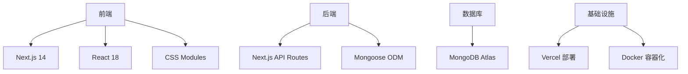

# 🚀 Prompt 市场


一个基于现代Web技术构建的Prompt分享平台，采用Next.js框架和MongoDB数据库，支持多平台登录和内容审核机制。

## 📋 目录
- [核心功能](#✨-核心功能)
- [技术架构](#🛠️-技术架构)
- [快速开始](#🚀-快速开始)
- [部署指南](#🌐-部署指南)
- [项目路线图](#🗺️-项目路线图)
- [贡献指南](#🤝-贡献指南)

## ✨ 核心功能

| 功能类别       | 已实现功能                            | 状态    |
|----------------|-------------------------------------|---------|
| **用户认证**    | GitHub/Google OAuth 登录            | ✅ 完成 |
| **内容管理**    | Prompt创建/编辑/删除                 | ✅ 完成 |
| **内容审核**    | 管理员审核流程                       | ✅ 完成 |
| **社交互动**    | 评论/点赞/收藏功能                   | ✅ 完成 |
| **内容发现**    | 高级搜索与过滤                       | ✅ 完成 |
| **通知系统**    | 实时用户通知                         | ✅ 完成 |
| **试用功能**    | 试用功能                             | ✅ 完成 |

## 🛠️ 技术架构



## 🚀 快速开始

### 前置要求
- Node.js 18+
- MongoDB Atlas 账号
- GitHub/Google OAuth应用

### 本地开发
```bash
# 1. 克隆仓库
git clone https://github.com/<your-username>/prompt-marketplace.git
cd prompt-marketplace

# 2. 安装依赖
pnpm install  # 推荐使用pnpm

# 3. 配置环境
cp .env.sample .env.local
# 编辑.env.local文件填写实际配置

# 4. 启动开发服务器
pnpm dev
```

## 🌐 部署指南

### 环境变量配置
| 变量名                   | 必需 | 示例值                          | 说明                      |
|--------------------------|------|---------------------------------|-------------------------|
| `MONGODB_URI`            | ✅   | `mongodb+srv://<user>:<pass>@cluster.mongodb.net/db` | MongoDB连接字符串       |
| `NEXTAUTH_SECRET`        | ✅   | `openssl rand -base64 32`       | 至少32位的随机字符串     |
| `GITHUB_CLIENT_ID`       | ✅   | `Iv1.1234567890abcdef`          | GitHub OAuth客户端ID     |
| `GITHUB_CLIENT_SECRET`  | ✅   | `9159fd5d8b66d388ad0d2e926caffc55940fe2a8` | GitHub OAuth客户端密钥 |
| `NEXT_PUBLIC_ADMIN_EMAILS` | ✅   | `1761886648@qq.com` | 管理员邮箱列表 |
| `OPENAI_DEFAULT_API_KEY`   | ✅   | `sk-proj-1234567890abcdef` | OpenAI API密钥 |
| `ZHIPU_DEFAULT_API_KEY`    | ✅   | `sk-proj-1234567890abcdef` | 智谱 API密钥 |
| `GOOGLE_DEFAULT_API_KEY`   | ✅   | `sk-proj-1234567890abcdef` | Google API密钥 |

### 生产环境构建
```bash
# 构建优化版本
pnpm build

# 启动生产服务器
pnpm start
```

> 📌 **提示**：生产环境部署前请确保：
> - 已配置HTTPS
> - 启用数据库访问白名单
> - 设置定期备份策略

## 🗺️ 项目路线图

- [x] 基础用户系统
- [x] Prompt管理功能
- [x] 内容审核机制
- [x] 社交互动功能
- [x] 高级搜索与过滤
- [x] 实时用户通知
- [ ] 高级分析仪表盘
- [ ] 多语言支持
- [ ] 移动端优化

## 🤝 贡献指南

欢迎通过以下方式参与贡献：
1. 提交Issue报告问题
2. Fork仓库并提交PR
3. 完善项目文档
4. 添加测试用例

请遵循[Conventional Commits](https://www.conventionalcommits.org/)规范提交代码。
